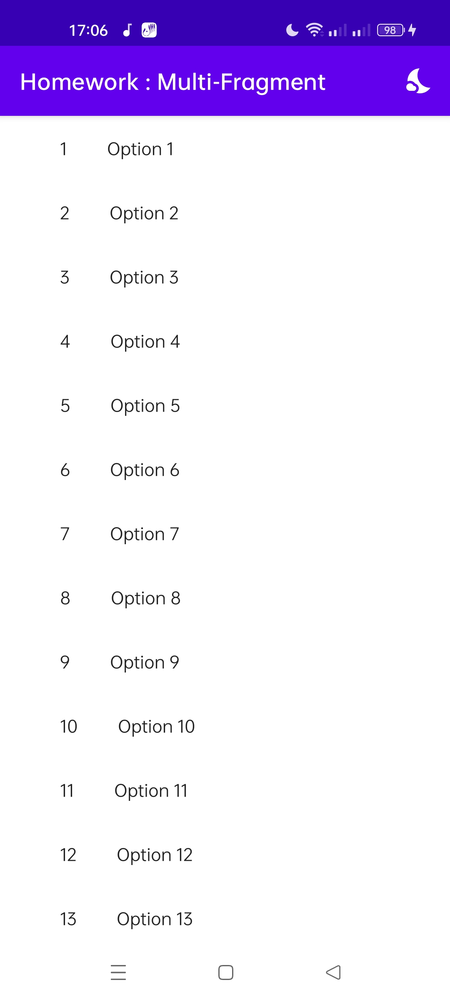
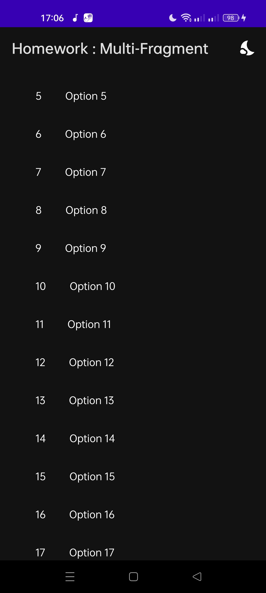
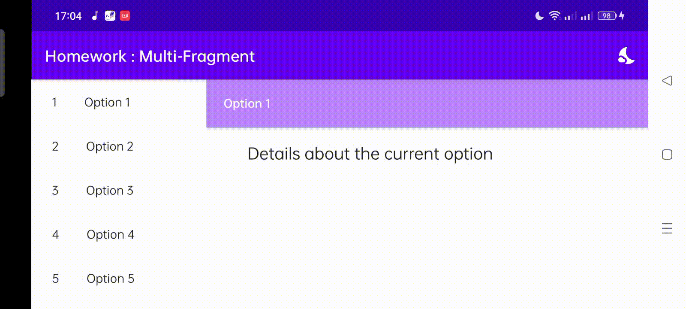

# Multi_Fragment
This is an example of a multi-pane layouts use case by adding a small feature allowing the application to switch from one theme to another (Light and dark theme)
# Screenshots and Demo

<table align="center">
  <tr>
    <td>Light Theme</td>
     <td>Dark Theme</td>
     <td colspan="2"> Demo (Portrait) </td>
  </tr>
  <tr>
    <td></td>
    <td></td>
    <td></td>
  </tr>
  <tr> 
  <td>Demo (Landscape)</td>
  <td colspan="2"></td>
  </tr>
 </table>
 
